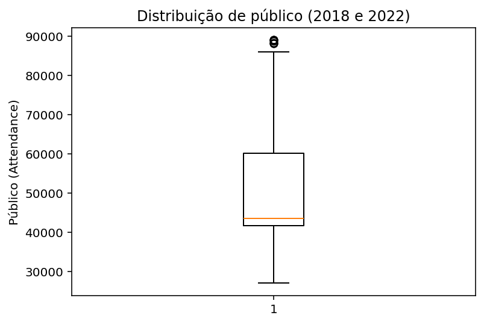
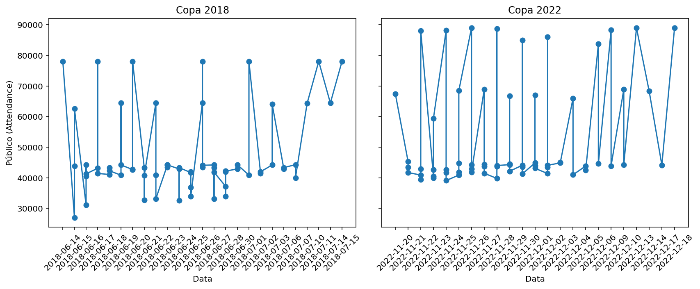

# Relatório da Missão 2: Análise Exploratória de Dados (EDA)

**Ferramentas:** Python (Spyder/Anaconda), Pandas, Matplotlib.

**Escopo:** Copas do Mundo de 2018 e 2022 (`matches_1930_2022.csv` filtrado por ano),
consistente com o recorte definido na Missão 1.

Esta etapa consiste em tratar valores ausentes, identificar inconsistências, detectar
outliers, construir visualizações e gerar insights a partir do dataset já explorado
via SQL na Missão 1.

---

## 1. Carregamento e escopo dos dados

* **Objetivo:** carregar os CSVs originais e restringir a análise ao escopo do
  desafio (Copas de 2018 e 2022), mantendo consistência com os números já
  validados na Missão 1 (964 partidas no total, 22 edições, 211 seleções).

* **Código:**
```python
import pandas as pd

matches = pd.read_csv('matches_1930_2022.csv')
world_cup = pd.read_csv('world_cup.csv')
ranking_2022 = pd.read_csv('fifa_ranking_2022-10-06.csv')

matches_filtrado = matches[matches['Year'].isin([2018, 2022])].copy()
```

* **Resultado:** dataset restrito a 128 jogos (64 de cada edição), consistente com
  o padrão de Copas de 32 seleções.

* **Insight:** o volume após o filtro bate com o esperado, confirmando que o
  recorte por ano foi aplicado corretamente antes de qualquer tratamento.

---

## 2. Tratar valores ausentes

* **Objetivo:** mapear os valores nulos em `matches_filtrado`, `world_cup` e
  `ranking_2022`, e distinguir entre "dado realmente faltando" e "evento que não
  aconteceu naquele jogo" (ex: cartão vermelho, gol contra, disputa de pênaltis).

* **Código:**
```python
print(matches_filtrado.isnull().sum())
print(world_cup.isnull().sum())
print(ranking_2022.isnull().sum())
```

* **Resultado:** `world_cup` e `ranking_2022` não têm nenhum valor nulo. Em
  `matches_filtrado`, a maioria dos nulos está concentrada em colunas de eventos
  específicos do jogo (cartões, gols contra, pênaltis) — nulo ali significa que o
  evento não ocorreu, não que o dado esteja faltando. As colunas de xG
  (`home_xg`/`away_xg`), que tinham 836 nulos no dataset completo (1930–2022),
  caíram para **0 nulos** após o filtro de 2018/2022 — a ausência era por
  cobertura histórica da métrica (xG só passou a ser registrado em Copas
  recentes), não por falha de coleta.

* **Insight:** a maior parte dos "valores ausentes" em `matches` não representa
  um problema de qualidade de dados — representa a estrutura natural do jogo
  (nem todo jogo tem cartão vermelho ou vai a pênaltis) ou uma limitação de
  cobertura histórica da fonte (xG). Isso evita um erro comum de tratar esses
  nulos com preenchimento estatístico (média, mediana) quando o correto é
  simplesmente reconhecer a ausência do evento.

### 2.1 Caso especial: a coluna `Notes`

* **Objetivo:** investigar a coluna `Notes` (118 nulos em 128), que aparentava
  ser inútil por estar quase toda vazia.

* **Código:**
```python
print(matches_filtrado[matches_filtrado['Notes'].notnull()][['Date', 'home_team', 'away_team', 'Notes']])

matches_filtrado['penaltis'] = matches_filtrado['Notes'].str.contains('penalty kicks', na=False)
print(matches_filtrado['penaltis'].value_counts())
```

* **Resultado:** dos 128 jogos, 9 foram decididos na disputa de pênaltis
  (incluindo Brasil x Croácia, já analisado na Missão 1), e 1 jogo adicional
  teve prorrogação sem ir aos pênaltis.

* **Insight:** a coluna `Notes`, originalmente quase toda nula, não representava
  dado faltando — representava a ausência do evento "empate no tempo normal em
  jogo eliminatório". Transformá-la numa coluna booleana (`penaltis`) fez com que
  deixasse de ser texto livre inútil e passasse a alimentar diretamente análises
  quantitativas, como a taxa de jogos decididos por pênaltis no mata-mata.

---

## 3. Identificar inconsistências

* **Objetivo:** ao contar cartões amarelos por seleção, validar se os valores de
  mandante e visitante estavam sendo calculados corretamente.

* **Código:**
```python
matches_filtrado['qtd_amarelo_home'] = matches_filtrado['home_yellow_card_long'].apply(contar_cartoes)
matches_filtrado['qtd_amarelo_away'] = matches_filtrado['away_yellow_card_long'].apply(contar_cartoes)
```

* **Resultado:** ao contar cartões amarelos separadamente para mandante e
  visitante em cada partida, o cruzamento com o jogo Argentina x França
  (final de 2022) confirmou 5 cartões para a Argentina e 3 para a França —
  validando que a lógica de contagem reflete corretamente os dados de cada
  lado do confronto.

* **Insight:** escolher um jogo de alto perfil (a final) como caso de
  verificação facilita a checagem, já que os números daquela partida
  específica são fáceis de confirmar em outras fontes.

---

## 4. Detectar outliers

* **Objetivo:** verificar se existem jogos com público (`Attendance`) muito
  acima ou abaixo do padrão do dataset.

* **Código:**
```python
print(matches_filtrado['Attendance'].describe())

import matplotlib.pyplot as plt
plt.figure(figsize=(6,4))
plt.boxplot(matches_filtrado['Attendance'])
plt.title('Distribuição de público (2018 e 2022)')
plt.ylabel('Público (Attendance)')
plt.show()
```

* **Resultado:** média de ~50.281 espectadores por jogo, mediana de ~43.549 —
  a diferença entre média e mediana indica uma distribuição assimétrica à
  direita (alguns jogos muito cheios puxam a média para cima). O boxplot mostrou
  2 pontos isolados acima de ~88 mil, identificados como outliers.



* **Código (identificando os outliers):**
```python
top_publico = matches_filtrado.nlargest(5, 'Attendance')[['Date', 'home_team', 'away_team', 'Round', 'Attendance']]
print(top_publico)
```

* **Resultado:** os 5 jogos de maior público foram todos da Copa de 2022,
  sediados no Estádio Lusail (Catar), com 3 jogos de fases distintas (final,
  semifinal e um jogo de fase de grupos) atingindo exatamente 88.966 pessoas —
  a capacidade máxima do estádio.

* **Insight:** os outliers de público não indicam erro de coleta, mas sim
  lotação máxima do maior estádio da Copa 2022, atingida em jogos de fases
  distintas. Um padrão adicional: 3 dos 5 jogos mais concorridos envolveram a
  Argentina, sugerindo grande procura por ingressos da torcida argentina ao
  longo de todo o torneio, não só na final.

---

## 5. Construir visualizações

* **Objetivo:** visualizar a evolução do público ao longo dos jogos de cada
  edição (2018 e 2022), lado a lado.

* **Código:**
```python
fig, axes = plt.subplots(1, 2, figsize=(12, 5), sharey=True)

for ax, ano in zip(axes, [2018, 2022]):
    dados = matches_filtrado[matches_filtrado['Year'] == ano].sort_values('Date')
    ax.plot(dados['Date'], dados['Attendance'], marker='o', linestyle='-')
    ax.set_title(f'Copa {ano}')
    ax.set_xlabel('Data')
    ax.tick_params(axis='x', rotation=45)

axes[0].set_ylabel('Público (Attendance)')
plt.tight_layout()
plt.show()
```



* **Resultado:** o público não segue uma tendência de crescimento suave ao longo
  do torneio — ele oscila bastante mesmo dentro da fase de grupos, refletindo
  mais o tamanho do estádio de cada jogo específico do que uma tendência
  temporal.

* **Insight:** manter a escala compartilhada entre os dois gráficos (2018 e
  2022) permite comparar diretamente o "patamar" de público entre as duas
  edições, mostrando que a Copa de 2022 teve picos de público mais altos e mais
  frequentes que 2018.

---

## 6. Cartões por seleção

* **Objetivo:** somar cartões amarelos e vermelhos por seleção (mandante +
  visitante) para identificar padrões de indisciplina no período.

* **Código:**
```python
import ast

def contar_cartoes(valor):
    if pd.isnull(valor):
        return 0
    lista = ast.literal_eval(valor)
    return len(lista)

matches_filtrado['qtd_amarelo_home'] = matches_filtrado['home_yellow_card_long'].apply(contar_cartoes)
matches_filtrado['qtd_amarelo_away'] = matches_filtrado['away_yellow_card_long'].apply(contar_cartoes)

matches_filtrado['qtd_vermelho_home'] = matches_filtrado['home_red_card'].notnull().astype(int)
matches_filtrado['qtd_vermelho_away'] = matches_filtrado['away_red_card'].notnull().astype(int)

cartoes_home = matches_filtrado.groupby('home_team')[['qtd_amarelo_home', 'qtd_vermelho_home']].sum()
cartoes_away = matches_filtrado.groupby('away_team')[['qtd_amarelo_away', 'qtd_vermelho_away']].sum()

cartoes_home.columns = ['amarelos', 'vermelhos']
cartoes_away.columns = ['amarelos', 'vermelhos']

cartoes_total = cartoes_home.add(cartoes_away, fill_value=0)
cartoes_total = cartoes_total.sort_values('amarelos', ascending=False)
cartoes_total.index.name = 'selecao'
print(cartoes_total.head(10))
```

* **Resultado:** a Argentina lidera em cartões amarelos no período (30), seguida
  por Croácia (23), Sérvia (21) e França (20). Cartões vermelhos são raros no
  geral — só 2 casos aparecem no Top 10 (Suíça e Coreia do Sul, 1 cada).

* **Insight:** Argentina, Croácia e França — os 3 times com mais cartões
  amarelos — foram justamente os 3 finalistas/semifinalistas de 2022 (Argentina
  campeã, França vice, Croácia 3º lugar). Isso sugere que times que avançam mais
  fases acumulam mais cartões simplesmente por jogar mais partidas (incluindo
  jogos de mata-mata com prorrogação), não necessariamente por jogar "mais
  sujo". Essa contagem não é normalizada por número de jogos disputados —
  fica registrado como uma limitação da análise.

---

## 7. xG (gols esperados) vs gols reais

* **Objetivo:** comparar, por seleção, quantos gols cada time fez de verdade
  contra quantos "deveria" ter feito segundo a qualidade das chances criadas
  (xG), identificando quem superou ou ficou abaixo da expectativa.

* **Código:**
```python
xg_home = matches_filtrado.groupby('home_team').agg(
    gols_feitos=('home_score', 'sum'),
    xg_total=('home_xg', 'sum')
)
xg_away = matches_filtrado.groupby('away_team').agg(
    gols_feitos=('away_score', 'sum'),
    xg_total=('away_xg', 'sum')
)

xg_total = xg_home.add(xg_away, fill_value=0)
xg_total['diferenca'] = xg_total['gols_feitos'] - xg_total['xg_total']
xg_total = xg_total.sort_values('diferenca', ascending=False)
```

* **Resultado:** a França liderou o ranking de eficiência ofensiva, convertendo
  7,1 gols a mais do que o esperado pelo xG (30 gols feitos vs 22,9 esperados).
  O Brasil teve o pior desempenho de conversão do período: fez 16 gols reais
  contra um xG de 23,7 — um déficit de quase 8 gols, o maior entre as 38
  seleções analisadas.

* **Insight:** o Brasil criou volume de chances muito acima da média (23,7 xG,
  atrás só de times como França e Inglaterra), mas converteu muito abaixo do
  esperado. Isso dá um contraponto estatístico ao insight da Missão 1: o Brasil
  não foi eliminado por falta de criação ofensiva, mas por ineficiência na
  finalização — um problema que fica mascarado quando se olha só o resultado
  final (eliminação nos pênaltis contra a Croácia).

### 7.1 Detalhe: o jogo Brasil x Croácia

* **Objetivo:** olhar o xG específico do jogo eliminatório entre Brasil e
  Croácia (quartas de final, 2022), fechando o arco de análise iniciado na
  Missão 1.

* **Código:**
```python
jogo_brasil_croacia = matches_filtrado[
    ((matches_filtrado['home_team'] == 'Brazil') & (matches_filtrado['away_team'] == 'Croatia')) |
    ((matches_filtrado['home_team'] == 'Croatia') & (matches_filtrado['away_team'] == 'Brazil'))
]
print(jogo_brasil_croacia[['home_team', 'home_score', 'home_xg', 'away_team', 'away_score', 'away_xg']])
```

* **Resultado:** no confronto das quartas de final de 2022, o Brasil teve xG de
  2,5 contra 0,6 da Croácia — mais de 4x a qualidade de chances do adversário —
  mas o placar terminou empatado em 1x1, sendo o Brasil eliminado na disputa de
  pênaltis.

* **Insight:** esse jogo é a evidência mais direta de todo o arco de análise
  construído desde a Missão 1: o Brasil dominou estatisticamente o confronto
  (xG de 2,5 vs 0,6), tinha o ranking FIFA mais alto entre os 32 times, mas foi
  eliminado por uma combinação de baixa conversão de chances (consistente com
  seu déficit de -7,7 no torneio inteiro) e o fator de acaso inerente a uma
  disputa de pênaltis. Isso demonstra, com dados concretos, o limite do
  "favoritismo no papel" (ranking, xG, criação de jogo) em prever resultados de
  mata-mata no futebol.

---
