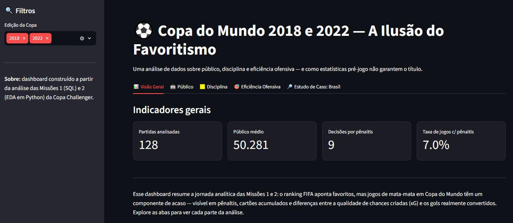
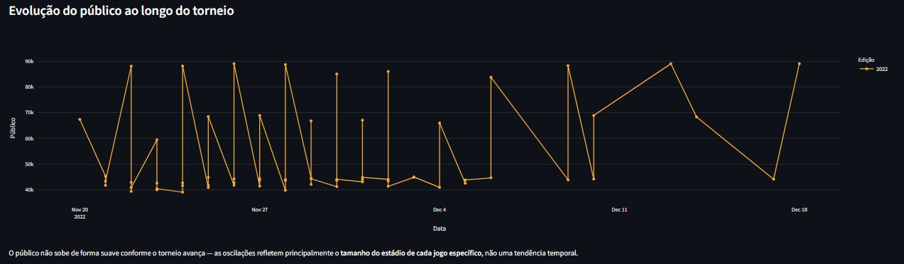
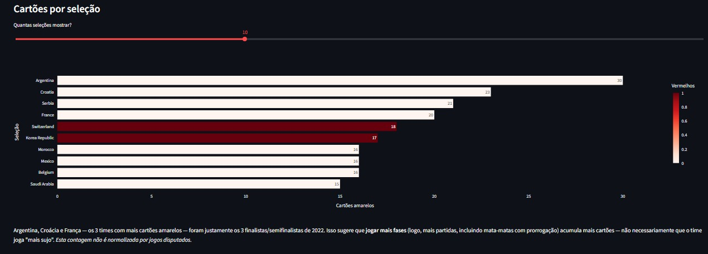
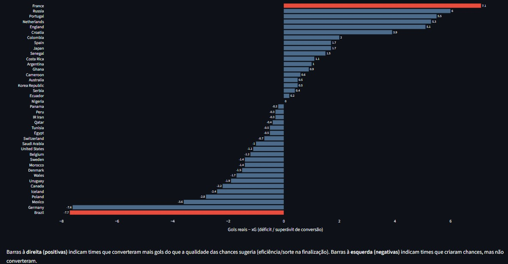
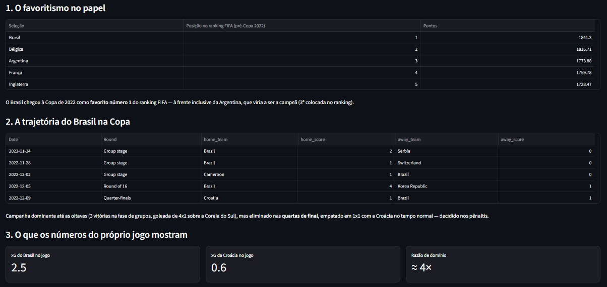

# Relatório da Missão 3: Dashboard e Storytelling

**Ferramentas:** Python, Streamlit, Plotly.

**Decisão de ferramenta:** optei pelo Streamlit em vez do Power BI porque
permite reaproveitar diretamente o código Python (pandas) já construído na
Missão 2 — os mesmos cálculos de xG, cartões e outliers de público alimentam
o dashboard sem precisar reimportar ou remodelar os dados numa ferramenta
separada.

**Como rodar:**
```bash
pip install streamlit plotly
streamlit run dashboard.py
```

---

## 1. Indicadores (KPIs) escolhidos

Na aba "Visão Geral", quatro indicadores resumem a análise antes de o usuário
explorar as abas temáticas:

| Indicador | Por que foi escolhido |
|---|---|
| Partidas analisadas | Confirma o escopo/volume de dados por trás do dashboard (transparência). |
| Público médio | Contextualiza a escala do torneio antes de entrar no detalhe de outliers. |
| Decisões por pênaltis | Resume, num único número, o achado central da Missão 2: o fator de acaso no mata-mata. |
| Taxa de jogos com pênaltis | Mesma ideia acima, mas em percentual — facilita comparar entre diferentes filtros de edição. |



*Print acima: visão geral com o filtro em "2018 e 2022" (ambas as edições) —
128 partidas, público médio de 50.281, 9 jogos decididos por pênaltis (7,0%
do total).*

---

## 2. Estrutura de navegação (abas)

O dashboard foi dividido em **5 abas** (Visão Geral, Público, Disciplina,
Eficiência Ofensiva, Estudo de Caso) em vez de uma única página com scroll.
A decisão evita sobrecarga visual — cada gráfico tem espaço para ser lido com
calma — e segue a mesma ordem lógica da investigação nas Missões 1 e 2: do
geral (KPIs) para o específico (o estudo de caso do Brasil).

Também foi adicionado um filtro na barra lateral (seleção de edição: 2018,
2022, ou ambas), que recalcula todos os indicadores e gráficos das abas em
tempo real — permitindo que o próprio leitor explore a diferença entre as
duas Copas, em vez de depender só da leitura estática que eu escolhi. Na
maioria das abas essa comparação funciona bem com as duas edições juntas,
mas na aba de Público optei por documentar com um filtro por vez (ver seção
3), já que os gráficos de linha de cada ano ficam mais legíveis olhados
separadamente do que sobrepostos.

---

## 3. Aba: Público

Diferente das outras abas, aqui documentei com o filtro em **um ano por
vez**, porque o gráfico de evolução de público fica mais fácil de interpretar
sem misturar as duas séries temporais na mesma linha.

### Copa de 2022



### Copa de 2018


* **O que comunica:** um gráfico de linha interativo mostra a evolução do
  público jogo a jogo (com hover mostrando o valor exato), e um boxplot ao
  lado identifica outliers — reforçado por uma tabela com os 5 jogos de maior
  público daquela edição.
* **Decisão de design:** optei por manter o boxplot com `points='all'`
  (mostrando cada jogo como um ponto individual), em vez do boxplot "limpo"
  da Missão 2 — isso deixa visível não só os outliers extremos, mas também a
  concentração real dos dados dentro da caixa. Documentar por edição
  separada também evidencia que **2022 teve picos de público mais altos e
  mais frequentes que 2018** — em 2018 o teto de público (~78 mil, para os 5
  jogos mais concorridos) já era visivelmente mais baixo que o das Copa de
  2022 (~88,9 mil).
* **Insight reforçado:** em 2022, os 5 jogos mais concorridos foram todos no
  Estádio Lusail (Catar), com 3 deles atingindo exatamente 88.966 pessoas — a
  capacidade máxima do estádio — em fases diferentes do torneio (grupos,
  semifinal e final). Em 2018, o teto de público (78.011) se repete
  identicamente em 5 jogos de fases bem distintas (final, semifinal, oitavas,
  fase de grupos), sugerindo o mesmo padrão: um estádio de grande capacidade
  (provavelmente o Lujniki, em Moscou) sediando múltiplos jogos lotados.

---

## 4. Aba: Disciplina



* **O que comunica:** ranking de cartões amarelos por seleção (considerando
  as duas edições, 2018 e 2022), com a intensidade da cor vermelha
  representando o total de cartões vermelhos — permitindo ver duas
  informações no mesmo gráfico sem precisar de um segundo eixo.
* **Decisão de design:** adicionei um slider ("Quantas seleções mostrar?")
  para o próprio leitor controlar o tamanho do ranking (5 a 20 seleções),
  em vez de fixar um Top 10 arbitrário.
* **Insight reforçado:** Argentina lidera com 30 cartões amarelos no período,
  seguida por Croácia (23), Sérvia (21) e França (20) — justamente 3 dos 4
  finalistas/semifinalistas de 2022. Isso sugere que jogar mais fases (logo,
  mais partidas, incluindo mata-matas com prorrogação) acumula mais cartões,
  não necessariamente que o time joga "mais sujo". Suíça e Coreia do Sul são
  as únicas do Top 10 com cartão vermelho registrado (1 cada).

---

## 5. Aba: Eficiência Ofensiva (xG)



* **O que comunica:** todas as 38 seleções que jogaram 2018 ou 2022,
  ordenadas pelo déficit/superávit de conversão (gols reais menos xG),
  permitindo ver de uma vez quem converteu acima ou abaixo do esperado.
* **Decisão de design:** um filtro multi-seleção permite destacar seleções
  específicas em vermelho (no print, Brasil e França estão destacadas) —
  usado para chamar atenção justamente para o contraste que vira o estudo de
  caso da próxima aba.
* **Insight reforçado:** a França liderou a eficiência ofensiva (+7,1 gols
  acima do xG), enquanto o **Brasil teve o maior déficit entre as 38
  seleções** (-7,7), seguido de perto pela Alemanha (-7,6) — mostrando que
  "criar chance" e "confirmar favoritismo no placar" são coisas diferentes.

---

## 6. Aba: Estudo de Caso — Brasil



* **O que comunica:** esta é a aba que conecta os achados das abas anteriores
  numa única narrativa, em 3 partes:
  1. **O favoritismo no papel** — tabela do Top 5 do ranking FIFA pré-Copa
     2022, mostrando o Brasil em 1º.
  2. **A trajetória do Brasil na Copa** — tabela jogo a jogo até a eliminação
     nas quartas de final, decidida nos pênaltis.
  3. **O que os números do próprio jogo mostram** — métricas de xG do jogo
     Brasil x Croácia lado a lado (2,5 vs 0,6), com a razão de domínio
     calculada (~4×).
* **Decisão de design:** a conclusão do estudo de caso foi destacada num bloco
  de alerta verde (`st.success`), diferenciando visualmente "dado bruto" de
  "interpretação/conclusão" — o leitor sabe exatamente onde termina a
  evidência e começa a análise.
* **Insight final:** o Brasil não foi eliminado por falta de criação
  ofensiva — criou tanta chance quanto os favoritos ao título — mas por uma
  combinação de ineficiência na finalização (consistente durante todo o
  torneio) e o fator de acaso inerente a uma disputa de pênaltis.

---

## Conclusão da Missão 3

O dashboard cumpre as 4 tarefas do desafio: **KPIs relevantes** na visão
geral, **dashboards interativos** com filtros reais (edição da Copa, número
de seleções exibidas, destaque de seleções no xG), **comunicação clara** via
organização em abas temáticas, e **storytelling** na aba de Estudo de Caso,
que transforma dados soltos das Missões 1 e 2 numa única narrativa causal
sobre por que o favorito não venceu o torneio.